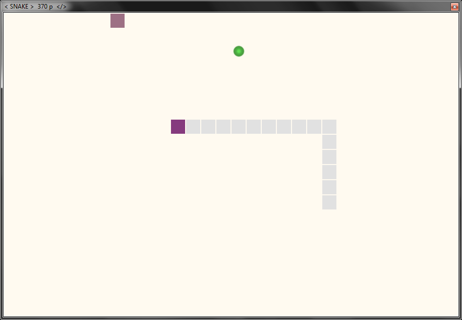
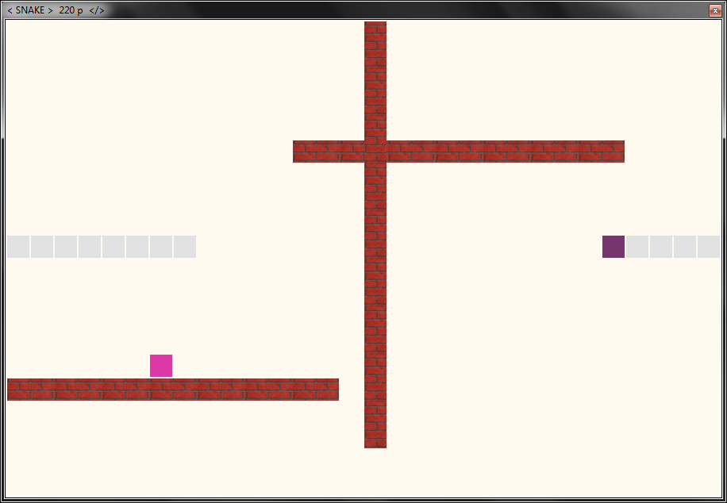
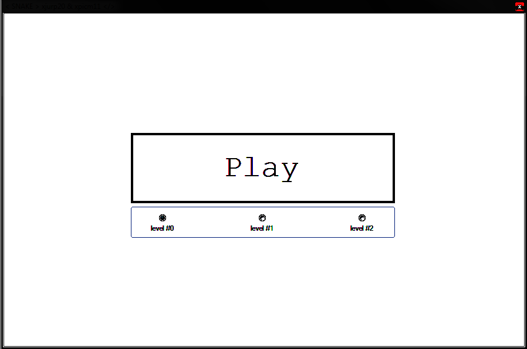

# the snake game

(c) 2013 Pavel Jurča

==> 4SA333, FIS, VŠE, 2013 <==

## INTRO

	* the snake game as you know it from Nokia

	* 3 levels
		* levels #1 and #2 have walls
		* at level#2 you can go through boundaries
	* bonus food
		* gives you half of the current score in addition
	* with every usual food snake accelerates

	* navigation keys
	* SPACE key pauses the game

the snake is increasing in speed just because Windows.Forms
can't handle a lot of moving Control objects, so they'll
start blinking, hence "game over" happens more quickly ;)

## TODO
	> changing score via Observer/Observable pattern
	> implement the game space as a TableLayoutPanel
		> row and column as index
		> game element as special subclass of Control
			> custom margin, name etc.
	// maybe completely rewrite to XNA framework
		> however VB.NET is not officially supported

## CODE
	> Win32 programm built on top of the System.Windows.Forms.Control objects
	> written in VisualBasic.NET
		> Microsoft Visual Studio 2010 Express
		> framework .NETv3.5

	> every grid of the game space has so-called 1px "margin.All"
	> calling 'quit' method on a SnakeGame instance causes ApplicationExitCall

